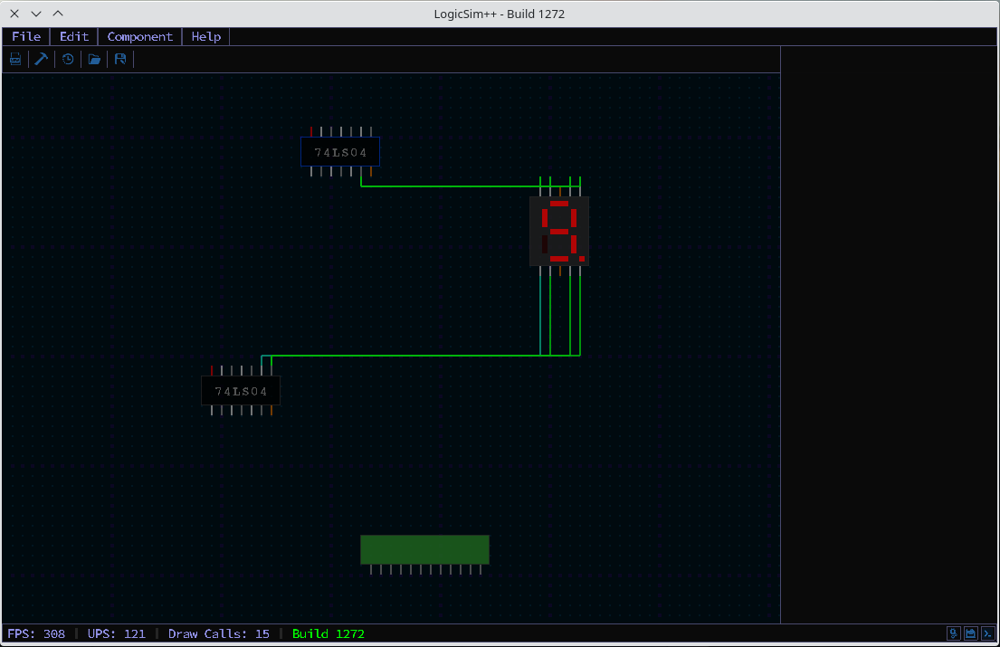
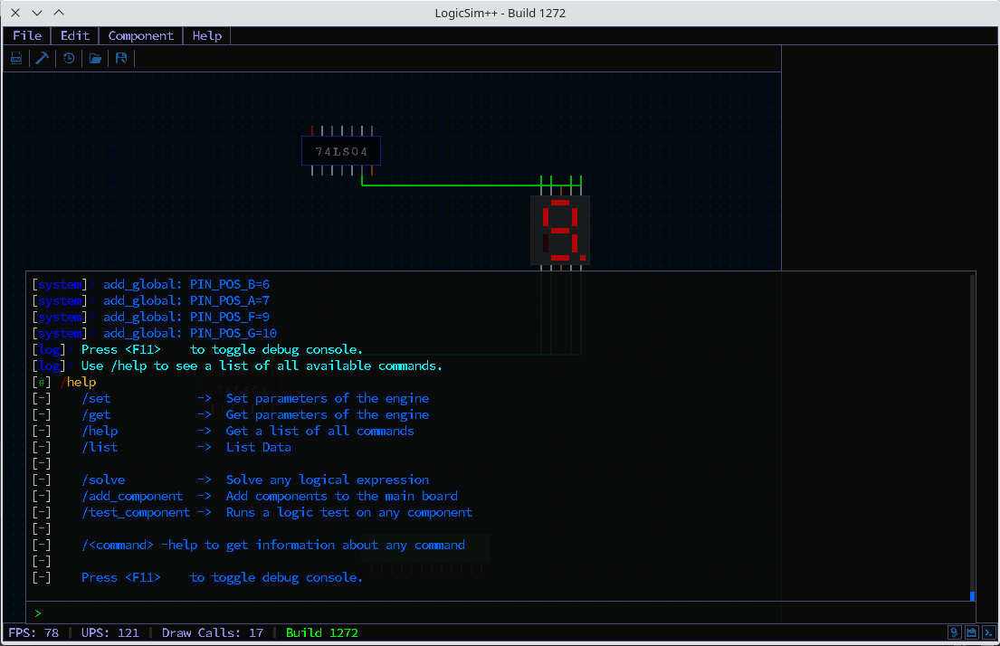

## LogicSim++ - A Logic-Circuit Simulator written in C++
 
 This project is built on the idea of a very old Java project, that was born as a school project (https://github.com/Sylar39/JLogicSim).
    

It is still in very early development, and is not usable right now. The goal of this project is to expand on the simplicity of JLogicSim, and simulate Logic circuits trying to stay faithful to real integrated circuits and logical design.
    
A simple test
 
    
The Debug-Console
 